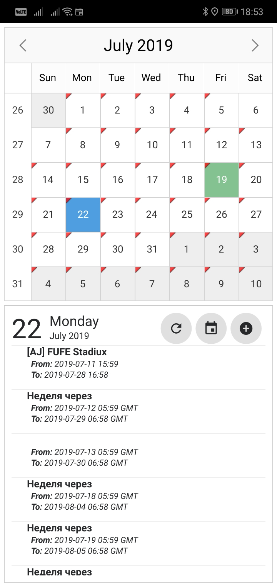
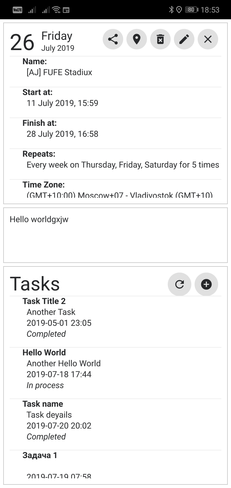
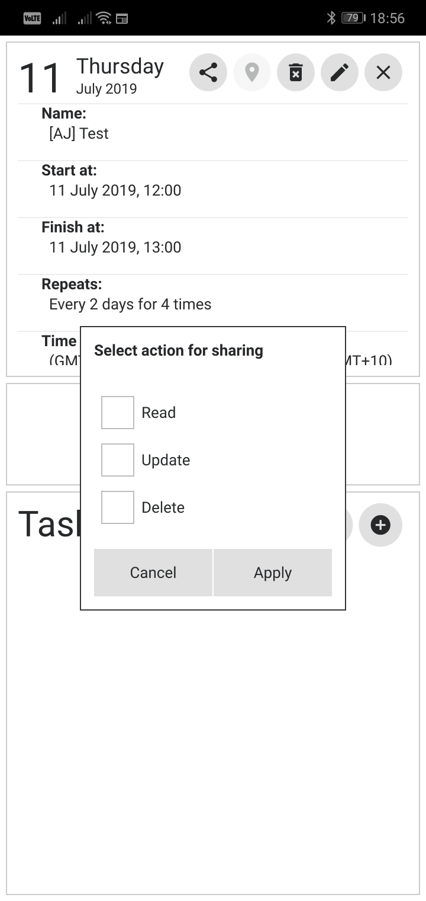
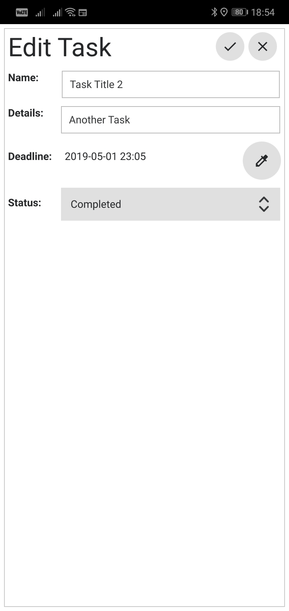
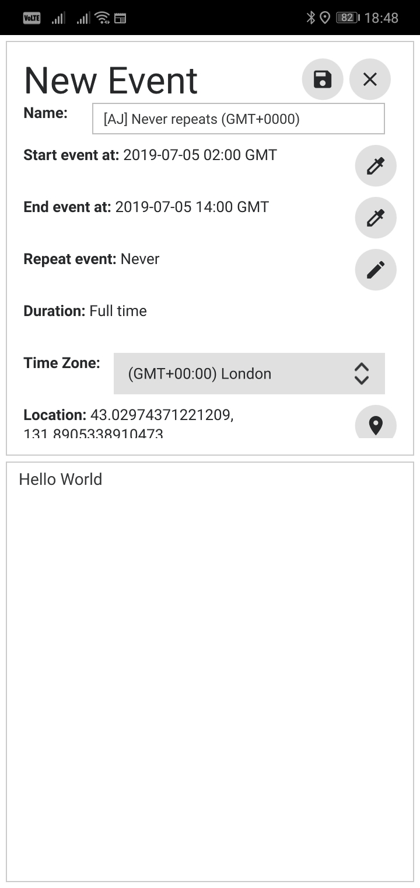
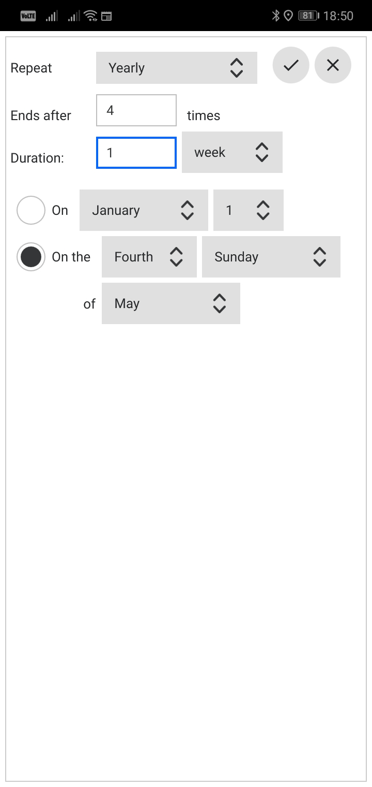
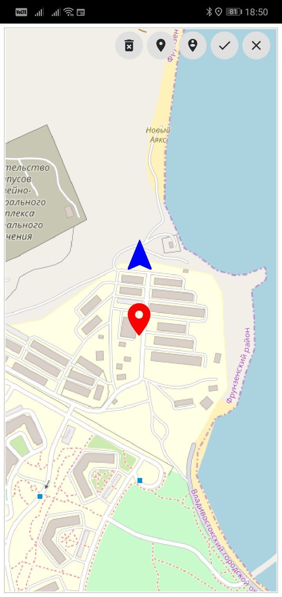

# QT Calendar

A simple calendar with events and tasks.
Calendar has synchronization with server. Supporting recurring events, share events by token.
Work with maps - *Open Street Maps*. Events can be marked on map.

Supporting timezones of event by select them in menu.

Code support to export calendar as *.ics* with server methods, but it's not included to interface.
It has local storage model of events, but after starting work with server, this module now unnecessary.

Can be build for PC (Linux/Windows), and Android.

Fully opensource. Using server's API, which you can get .
Also, for authorization, included module , but now not in use.

This project uses Google's [Material Design Icons](https://material.io/tools/icons/) font.

## Screenshots:

